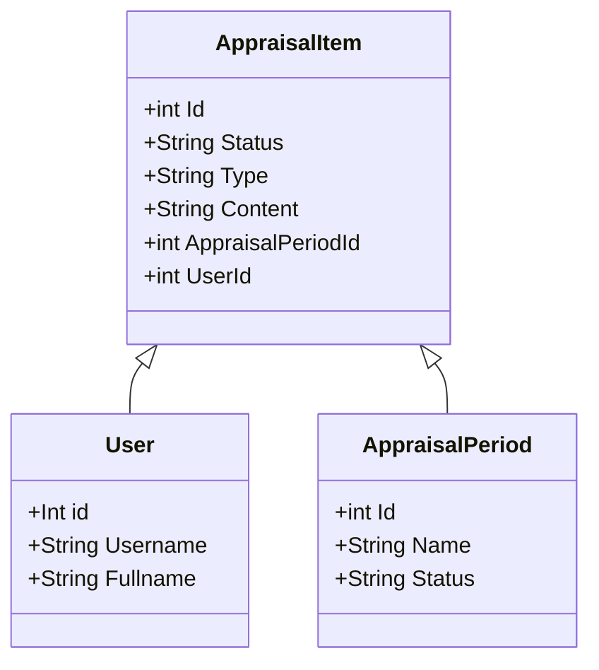

# Appraisal Application

## Dependencies

1. .Net Core
2. Entity Framework Core
3. SQLite

## Database Schema

Type of an AppraisalItem can be: Planned, Achieved, SWOT_Strength, SWOT_Weakness, SWOT_Thread, SWOT_Opportunity, Training, Training_Suggested